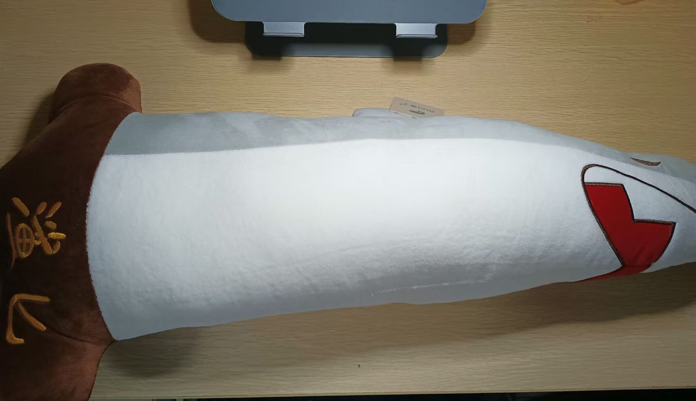
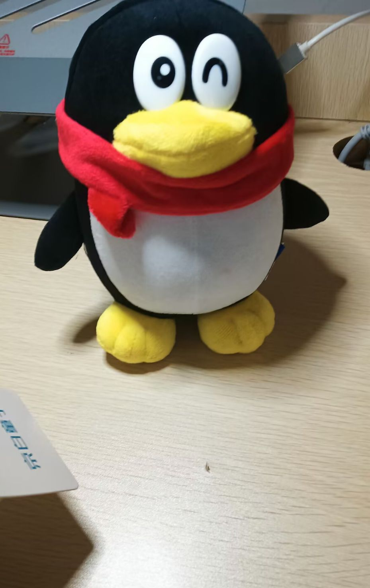
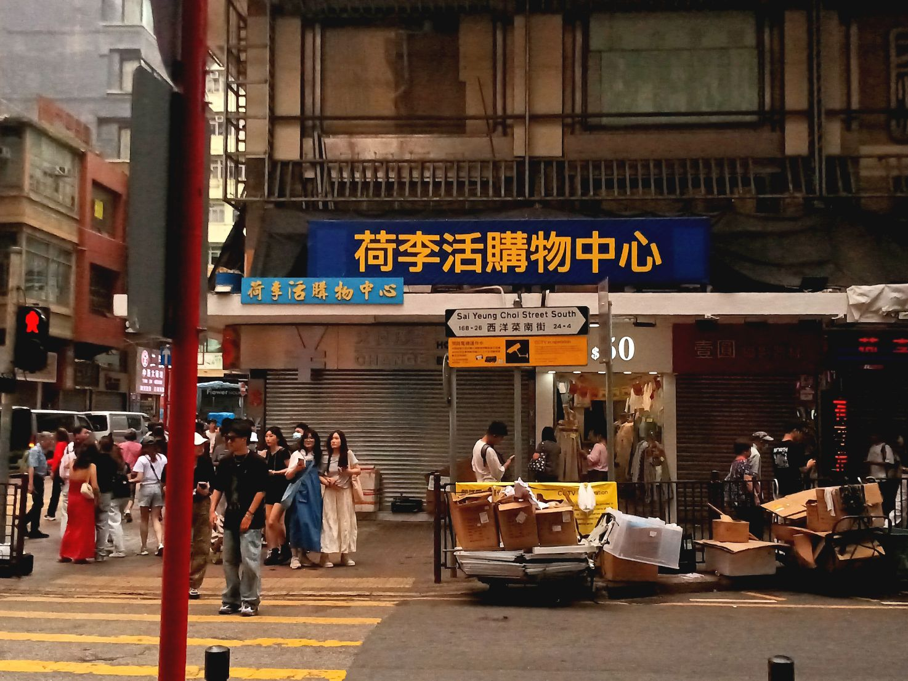
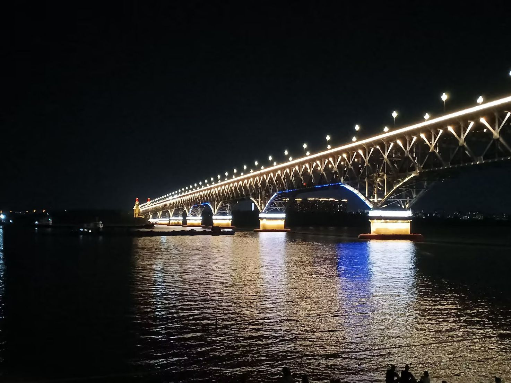
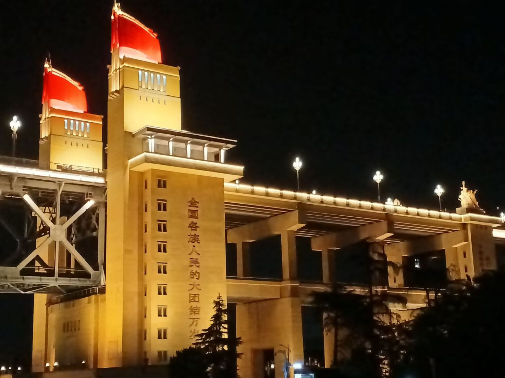
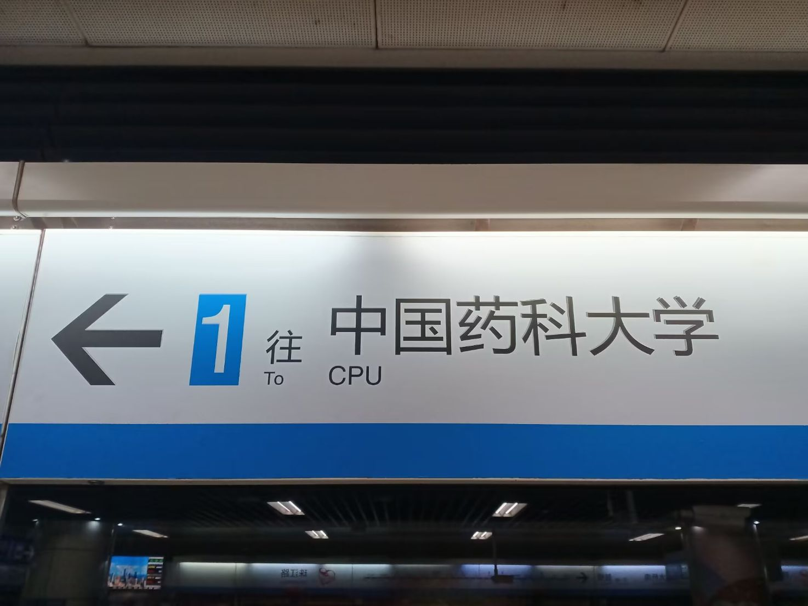

## 技术

今年的大头是神秘小程序开发。虽然不是特别企业级，但至少是第一次参与这种规模的前后端分离开发，企业级该有的流程都走了一遍；借着这个项目学了 Go 语言、钻研 Docker 等标配工具。
这才是真正的实践课的样子，每个新想法都需要调研、与竞品作比较，在这个过程中学习新概念；而不是像某些课程一样对着大纲指导书一通抄完事。我宁愿花费实打实的一学期做这些东西，也不想让某些实验浪费哪怕是一个小时。

托这个小程序开发的福，申请了大名鼎鼎的 GitHub Copilot 学生包；最开始是帮我解释 Go 代码的（犹记得看 `if err != nil` 一头雾水），后来逐渐成为了日常工作流的一环。不过我对 Agent 开发关注不多，是什么时候上线了 Agent 也记不太清了——总之很好用。

7 月份终于实现了一直以来的想法：在广阔的互联网拥有自己的一亩三分地。从挑选网站域名、卡在外汇折腾半天、挑选合适模板并做一点改造，总之其过程曲折，值得一篇单独的（咕咕）文章。

百团大战上作为 [OSA](https://wiki.osa.moe/)、[HOA](https://hoa.moe/) 双料特工摆摊，这也是 HOA 第一次线下宣传，反响不错。另外寒假期间为 HOA 撰写了[参与指南](https://hoa.moe/blog/contribution-guide/)，这指南的架构我是有考虑过相当长时间的，自认为脉络是比较清楚。

参加了哈工大的一校三区 CTF 新生赛，这次比赛我觉得非常成功，让我们这些新手能够相对低成本地入门 CTF，同时也非正式地起到了招新作用。虽然因为可恶的作业，实际参赛时长只有 1.5d/4d，但最后神秘地获得了校区三等奖、Web 方向二等奖，拿到神秘 QQ 玩偶和大鲨匕。

今年正式接触 qqbot 的开发，选用困困猫猫框架；感觉这个赛道已经很成熟了……

## 旅游

五一假期去了香港半日游，大概是十年以来又一次来到境外；由于时间不充足，也只能是特种兵旅游、打卡了一些景点就返屋企咗。

暑假和家人又去澳门，这下终于凑齐了特别行政区。比较深刻的是「威尼斯」和金碧辉煌的赌场。

暑假的尾巴上，赴约开源软件论坛，由南京大学承办。这也是我去过的最北边的地方了！见到好多高校的开源大佬和非常非常有钱的南大；但是有点奇怪，后面大半下午都在听高性能计算介绍。后面一晚上+一整天在南京闲逛，第一次见到长江（没去到北岸）；也看了好多好多博物馆。我现在是知道为什么深圳可以叫文化荒漠了，抛开博物馆等硬历史积淀不说，南京街头——哪怕是街道命名和普通的建筑物装饰——都带着历史的风韵。美中不足的是因为没有提前预约，更多的、更权威的博物馆也去不了。~~南京博物馆权威吗？~~

## 娱乐

年初加入 HITMC 大家庭，那时候原版服还是势头正猛，现在已经成为往日种种了……总之这是我加入的第三个服务器，也是待得最久的一个，在服里接触了服务器专用的各种高效率机器，也学习了一波。但今年好像没有时间研究原创机器。

今年有尝试到很多新的交际方式，比如舞会、唱K、约饭等等，也是维持了我的活人感。

去年我已经喜欢上 Otherside 吗？总之今年我非常非常非常喜欢，旧日的 Dreiton 已经失宠。感觉我的听歌风格与去年并无变化，喜欢的国语歌还是那些，依旧是喜欢听粤语老歌。下一个会喜欢的音乐风格是是什么呢，我也很好奇。

对文学的热情消退了许多，写一段文字抒发内心感想都需要绞尽脑汁；可能是说明文（技术文档）写太多导致的。

初学一点摄影构图、修图知识，但是还没有很多机会实践。希望明年有时间精进吧！
