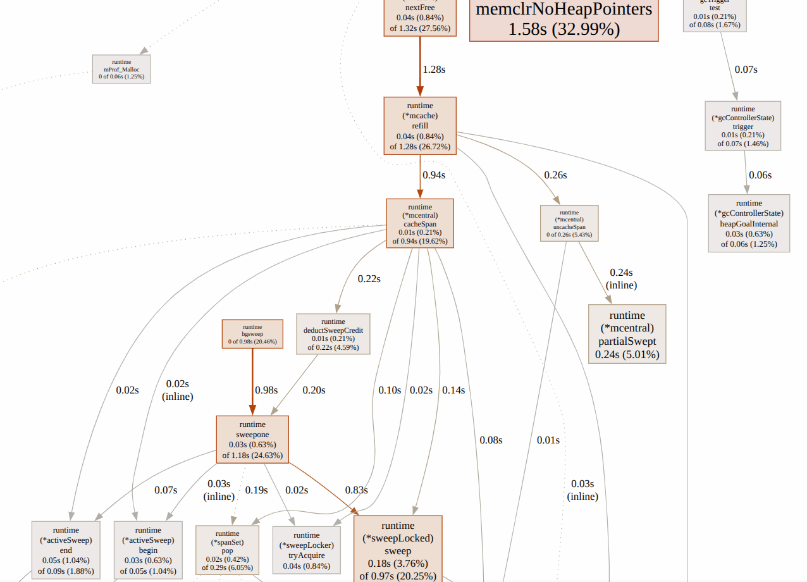

## 缘由

这篇文章来自笔者刷力扣的一点奇思妙想。以经典二维动态规划 [编辑距离](https://leetcode.cn/problems/edit-distance/description/) 为例，经常刷力扣的同学都知道，这类题目会有一个二维数组 `dp`，用来存储子问题的解。大部分人在写代码时，都会直接写成：

```go
m, n := len(s1), len(s2)
dp := make([][]int, m+1)
for i := range dp {
    dp[i] = make([]int, n+1) // 在循环中每次都调用一次 `make` 来分配一个新的切片
}
```

**但是**，在 [Effective Go](https://go.dev/doc/effective_go#two_dimensional_slices) 中，笔者看到一种 Go 官方推荐的做法：

> If the slices might not grow or shrink, it can be more efficient to construct the object with a single allocation.
>
> ```go
> m, n := len(s1), len(s2)
> dp := make([][]int, m+1)
> underlay := make([]int, (m+1)*(n+1)) // 仅调用一次 `make` 来分配一个大的切片
> for i := range dp {
>     dp[i], underlay = underlay[:n+1], underlay[n+1:] // 通过切片操作分配每一行
> }
> ```

实测，这两种方式在力扣 OJ 上的运行时间差别不大，用同样的状态转移方程都可以做到 0ms 和几乎相同的内存使用。那为什么 Go 官方认为第二种方式是**efficient**的？

## 记号说明

在下文中，我们把第一种方式称为非连续布局（Separate），记作 S；第二种方式称为连续布局（Contiguous），记作 C。

## 直观感受

从代码上来看，

- S 布局需要调用 m+1 次 make 函数来分配内存，但每一行的切片直接指向每次 make 分配的内存块
- C 布局需要调用一次 make 函数，但需要 m+1 次切片操作来分配每一行

直觉上，make 函数的调用开销应该比切片操作大。make 函数涉及在堆上分配内存，大概率有系统调用、与 GC 打交道之类的耗时指令；相比之下，Go 中的切片数据由指针表示，切片操作本质上是腾挪指针，要比调用 make 函数分配内存快得多：

```go
// src/runtime/slice.go
type slice struct {
	array unsafe.Pointer
	len   int
	cap   int
}
```

也就是说，C 布局的运行开销应该比 S 布局小。但这只是直观感受，实际情况如何呢？

## Benchmark

```go
func allocSeparate(m, n int) [][]int {
	dp := make([][]int, m)
	for i := range dp {
		dp[i] = make([]int, n)
	}
	return dp
}

func allocContiguous(m, n int) [][]int {
	dp, underlay := make([][]int, m), make([]int, m*n)
	for i := range dp {
		dp[i], underlay = underlay[:n], underlay[n:]
	}
	return dp
}
```

这两个函数是被测对象，分别对应 S 布局和 C 布局。我们用 Go 的 benchmark 工具来测试它们的性能：

```go
func benchAlloc(b *testing.B, fn func(int, int) [][]int, m, n int) {
	for b.Loop() {
		fn(m, n)
	}
}
```
并设置多组方阵和非方阵测试数据，分别对应不同规模的二维切片分配。

<details>

```go
var allocCases = []benchCase{
	{name: "8x8", m: 8, n: 8},
	{name: "256x256", m: 256, n: 256},
	{name: "1024x1024", m: 1024, n: 1024},
	{name: "2048x2048", m: 2048, n: 2048},
	{name: "16x4096", m: 16, n: 4096},
	{name: "4096x16", m: 4096, n: 16},
	{name: "128x1024", m: 128, n: 1024},
	{name: "1024x128", m: 1024, n: 128},
}
```
</details>

在我的笔记本电脑上结果如下：

```bash
$ go test -bench=. -benchmem slice2d_bench_test.go
goos: linux
goarch: amd64
cpu: 13th Gen Intel(R) Core(TM) i9-13900H
BenchmarkAlloc/8x8/Separate-20           3169816               364.1 ns/op           704 B/op         9 allocs/op
BenchmarkAlloc/8x8/Contiguous-20         4733473               247.7 ns/op           704 B/op         2 allocs/op
BenchmarkAlloc/256x256/Separate-20          7461            158784 ns/op          530818 B/op       257 allocs/op
BenchmarkAlloc/256x256/Contiguous-20       10000            115274 ns/op          530820 B/op         2 allocs/op
BenchmarkAlloc/1024x1024/Separate-20         445           3134147 ns/op         8415883 B/op      1025 allocs/op
BenchmarkAlloc/1024x1024/Contiguous-20      1188            957516 ns/op         8415875 B/op         2 allocs/op
BenchmarkAlloc/2048x2048/Separate-20         178           6883636 ns/op        33603589 B/op      2049 allocs/op
BenchmarkAlloc/2048x2048/Contiguous-20       421           2802231 ns/op        33603585 B/op         2 allocs/op
BenchmarkAlloc/16x4096/Separate-20         10000            110743 ns/op          524675 B/op        17 allocs/op
BenchmarkAlloc/16x4096/Contiguous-20       10000            109354 ns/op          524676 B/op         2 allocs/op
BenchmarkAlloc/4096x16/Separate-20          3994            257603 ns/op          622593 B/op      4097 allocs/op
BenchmarkAlloc/4096x16/Contiguous-20        7003            169511 ns/op          622593 B/op         2 allocs/op
BenchmarkAlloc/128x1024/Separate-20         3309            333657 ns/op         1051779 B/op       129 allocs/op
BenchmarkAlloc/128x1024/Contiguous-20       3816            334851 ns/op         1051778 B/op         2 allocs/op
BenchmarkAlloc/1024x128/Separate-20         5060            317356 ns/op         1075843 B/op       1025 allocs/op
BenchmarkAlloc/1024x128/Contiguous-20       8068            335319 ns/op         1075842 B/op          2 allocs/op
```

测试的结论几乎也能支持我们的直观感受：C 布局的每一轮分配总时长，**几乎**都比 S 布局短，在 1024x1024 方阵上二者的分配速率比甚至达到了 1: 4.3。而最终分配的内存大小相同。

### 有意思的现象：

1. 行较少时两个布局分配速率差距不大；行越多，C 布局的优势越明显。
	为了验证这个现象我又跑了另一组测试，行数不同，但列数相同，结果如下：

	<details>

	```bash
	$ go test -bench=. -benchmem slice2d_row_test.go
	goos: linux
	goarch: amd64
	cpu: 13th Gen Intel(R) Core(TM) i9-13900H
	BenchmarkAlloc2/8x256/Separate-20                 224769              4841 ns/op           16576 B/op          9 allocs/op
	BenchmarkAlloc2/8x256/Contiguous-20               320248              3751 ns/op           16576 B/op          2 allocs/op
	BenchmarkAlloc2/64x256/Separate-20                 25479             44895 ns/op          132864 B/op         65 allocs/op
	BenchmarkAlloc2/64x256/Contiguous-20               43257             25004 ns/op          132864 B/op          2 allocs/op
	BenchmarkAlloc2/256x256/Separate-20                 7269            167081 ns/op          530819 B/op        257 allocs/op
	BenchmarkAlloc2/256x256/Contiguous-20              10000            125339 ns/op          530819 B/op          2 allocs/op
	BenchmarkAlloc2/512x256/Separate-20                 3498            346581 ns/op         1062147 B/op        513 allocs/op
	BenchmarkAlloc2/512x256/Contiguous-20               4718            360690 ns/op         1062146 B/op          2 allocs/op
	BenchmarkAlloc2/1024x256/Separate-20                1170            944792 ns/op         2124421 B/op       1025 allocs/op
	BenchmarkAlloc2/1024x256/Contiguous-20              1581            709891 ns/op         2124418 B/op          2 allocs/op
	BenchmarkAlloc2/2048x256/Separate-20                 798           1510245 ns/op         4243460 B/op       2049 allocs/op
	BenchmarkAlloc2/2048x256/Contiguous-20              2485            880432 ns/op         4243460 B/op          2 allocs/op
	BenchmarkAlloc2/4096x256/Separate-20                 380           3113531 ns/op         8486916 B/op       4097 allocs/op
	BenchmarkAlloc2/4096x256/Contiguous-20              1455            815917 ns/op         8486915 B/op          2 allocs/op
	```
	</details>

	结果从趋势上支持我们的结论。

2. `1024x128` 的非方阵，C 布局的分配速率反而比 S 布局慢。后来做了重复实验，发现这可能是波动导致的，总体来看，在这个测试用例上 C 布局的分配速率比 S 布局快。

   但似乎 C 布局的波动频率很高，在我做的十几次实验中就出现了两次「异常」值——大多数测例是 ~250000 ns/op ，而这两次异常值分别是 388539 ns/op、420749 ns/op。

## 动态分析

### 采样

首先分别跑两个测试用例，2048x2048 方阵，各跑 500 轮：

```bash
$ go test -run=^$ -bench='^BenchmarkAlloc/2048x2048/Contiguous$' -benchtime=500x -count=1 -cpuprofile=cpu_c2048.out -memprofile=mem_c2048.out -o bench_c2048.test

$ go test -run=^$ -bench='^BenchmarkAlloc/2048x2048/Separate$' -benchtime=500x -count=1 -cpuprofile=cpu_s2048.out -memprofile=mem_s2048.out -o bench_s2048.test
```

S 布局用时 3.51s，C 布局用时 1.81s，与之前结论一致。（但这部分差别并不大，$(3.51-1.81)/500 = 0.0034$，也就是，在这个量级下每一轮的差距不到 3 毫秒。**这可能也是力扣 OJ 上看不出差别的原因**）

### 调用链分析

祭出我们的大杀器 pprof，分析调用链上最耗时的函数，使用 `-flat` 参数分析函数自身耗时情况：

```bash
$ go tool pprof -top -flat ./bench_s2048.test cpu_s2048.out
File: bench_s2048.test
      flat  flat%   sum%        cum   cum%
     1.58s 32.99% 32.99%      1.58s 32.99%  runtime.memclrNoHeapPointers
     0.25s  5.22% 38.20%      0.25s  5.22%  runtime.madvise
     0.24s  5.01% 43.22%      0.24s  5.01%  runtime.(*mcentral).partialSwept (inline)
     0.22s  4.59% 47.81%      0.22s  4.59%  runtime.procyield
     0.18s  3.76% 51.57%      0.97s 20.25%  runtime.(*sweepLocked).sweep
     0.13s  2.71% 54.28%      0.13s  2.71%  internal/runtime/atomic.(*Uint32).Add (inline)
     0.13s  2.71% 56.99%      0.18s  3.76%  runtime.(*spanSet).push
     0.12s  2.51% 59.50%      0.12s  2.51%  runtime.headTailIndex.head (inline)
     0.10s  2.09% 61.59%      0.10s  2.09%  runtime.(*gcBitsArena).tryAlloc (inline)
     0.10s  2.09% 63.67%      0.11s  2.30%  runtime.(*pallocBits).summarize
     0.08s  1.67% 65.34%      0.31s  6.47%  runtime.(*mheap).freeSpanLocked
     0.08s  1.67% 67.01%      0.08s  1.67%  runtime.(*mspan).base (inline)
     0.07s  1.46% 68.48%      0.07s  1.46%  runtime.futex
	 (......)
```

```bash
go tool pprof -top -flat ./bench_c2048.test cpu_c2048.out
File: bench_c2048.test
      flat  flat%   sum%        cum   cum%
     1.56s 80.00% 80.00%      1.56s 80.00%  runtime.memclrNoHeapPointers
     0.07s  3.59% 83.59%      0.07s  3.59%  runtime.madvise
     0.02s  1.03% 84.62%      0.02s  1.03%  runtime.(*mheap).setSpans
     0.02s  1.03% 85.64%      0.02s  1.03%  runtime.(*unwinder).resolveInternal
     0.02s  1.03% 86.67%      0.02s  1.03%  runtime.forEachPInternal
     0.02s  1.03% 87.69%      0.02s  1.03%  runtime.futex
	 (......)
```

观察到两个有意思的现象：

1. 两边的耗时大头都是 `runtime.memclrNoHeapPointers`，这是 Go 运行时在清理内存，代表着新内存的分配。但两种布局的耗时分别为 1.56s/1.58s，差距不大。这说明，C 布局的**优势并不在于初始化内存**的速度。（顺带一提，这个函数在源码中是用汇编指令写就的）

2. 虽然 `runtime.memclrNoHeapPointers` 在两种布局上运行时间相近，但 S 布局上其比例仅占 32.99%，C 布局上占时长比例高达 80.00%，说明这两种布局的时间差不在分配内存，而是另有其他耗时部分。
   
   对比上面两个 top 的结果，结合 S 布局的调用图 
   可以看出，`runtime.madvise`（向操作系统归还内存）、`runtime.(*sweepLocked).sweep`（并发清扫函数，GC 的一个步骤）等函数在 S 布局上耗时明显高于 C 布局。也就是说，S 布局的**额外开销在于 GC** 相关的函数；结合 `sum%` 数据看出，这部分的耗时并不比申请内存部分低。

## 结论

到这里，结论就很明确了：C 布局相对于 S 布局的优势，**是 GC 相关的开销更低**，而不是 `makeSlice` 等分配内存的开销——后者在两种布局中相近。这个结论与我猜想的还是有挺大区别——毕竟从代码上看，S 布局最大的特点就是频繁申请切片内存。

## 讨论

我们之前提过「切片操作本质上是腾挪指针」，并没有在上述测试中体现出来。

使用 `$ go tool objdump -s "allocContiguous" bench_c2048.test` 来查看汇编指令，在` dp[i], underlay = underlay[:n], underlay[n:]` 这一行，让 AI 大人帮笔者查阅（因为对汇编知之甚少），确实是在做我们的切分操作，包括计算指针地址、修改切片的 len 和 cap 等等。

当然，其中出现了
```asm
CALL runtime.gcWriteBarrier2(SB)
CALL runtime.panicSliceB(SB)
CALL runtime.panicSliceAcap(SB)
```
等函数调用，但从动态分析来看，这些函数并没有被调用。

另外是关于命名的问题。